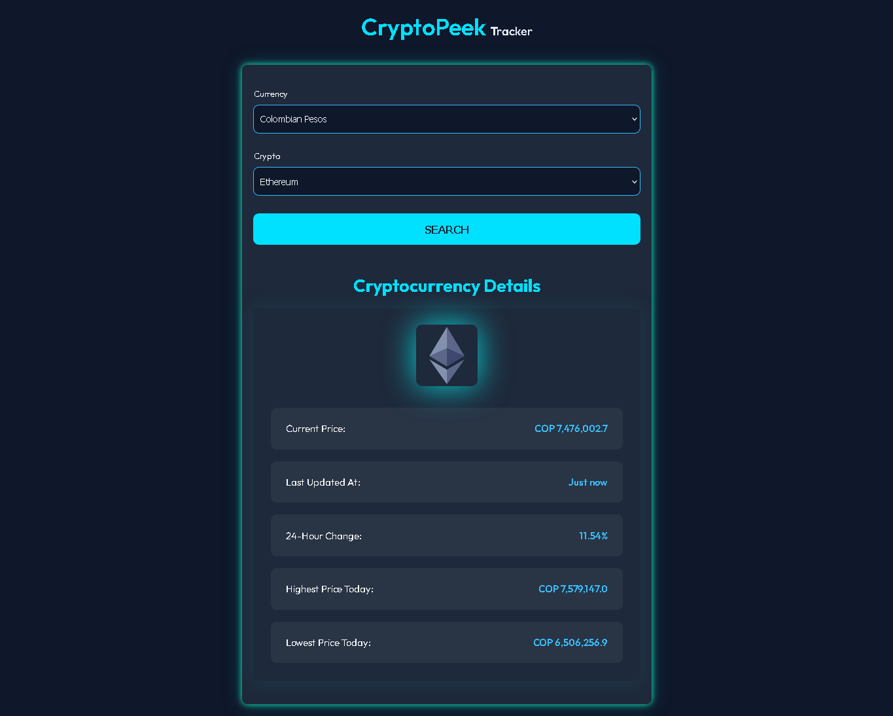

# CryptoPeek

CryptoPeek is a lightweight and minimalistic web app to fetch and display real-time cryptocurrency information in a specific fiat currency.

This project is particularly useful when you need quick, accurate data about a certain cryptocurrency without the noise or complexity of a full trading platform.

---

## ✨ Features

- Search by popular cryptocurrencies (e.g., Bitcoin, Ethereum)
- Display value in a chosen fiat currency (e.g., USD, EUR, COP)
- Real-time data from [CryptoCompare API](https://www.cryptocompare.com/)
- API Response validation with Zod
- Global state management using Zustand
- Clean and responsive UI with custom CSS

---


## 🚀 Live Demo

Check out the app here: [Live Demo](https://crypto-peek.netlify.app/) 

---


## 🎓 Tech Stack

- **React** 
- **Zod**
- **Zustand** 
- **CSS** 

---


## 🖼️ Screenshot

 <!-- Replace or move screenshot to the correct path if needed -->

---

## ⚡ Getting Started

1. Clone the repo:
   ```bash
   git clone https://github.com/Diego3128/cryptopeek.git
   cd cryptopeek
   ```

2. Install dependencies:
   ```bash
   npm install
   ```

3. Run the dev server:
   ```bash
   npm run dev
   ```

---

## ✈ License

This project is open-source and available under the [MIT License](LICENSE).

